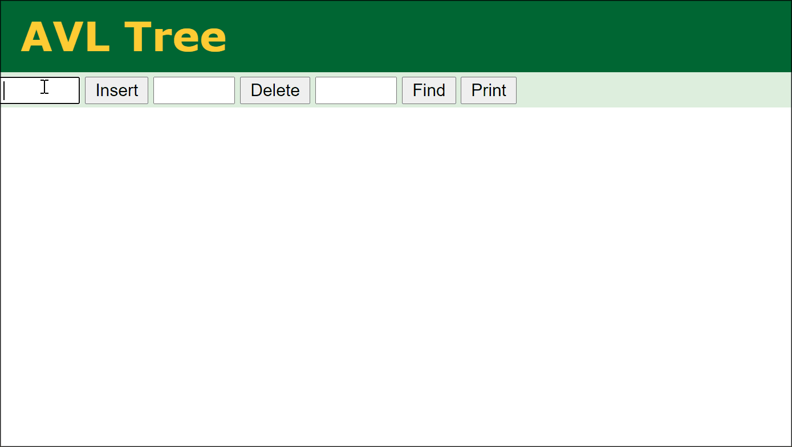

# AVL-Tree Algorithm

> 2021.01.13 (Tru.)

#### 期末作業：演算法 Project 或報告 -- 請實作某個課堂範例沒有的演算法，並撰寫詳細的報告與測試。
* 說明：
    例如：紅黑樹、B Tree、雜湊表...，應有報告，程式，並分析其複雜度！

* 作業繳交區：[ccccourse/se109a/issues/4_GitHub](https://github.com/ccccourse/se109a/issues/4)

## 題目選定：AVL-Tree
1. AVL-Tree 簡介
2. 範例執行
3. 程式碼說明
4. 分析與小結

### 概念圖：
* Insert the number: 10 → 20 → 30 → 40 → 50 → 15 → 12

[[1] 資料結構與演算法：AVL Tree_Joseph's Blog_2019](https://josephjsf2.github.io/data/structure/and/algorithm/2019/06/22/avl-tree.html) 
[[2] AVLtree 的圖形化工具](https://www.cs.usfca.edu/~galles/visualization/AVLtree.html) 

