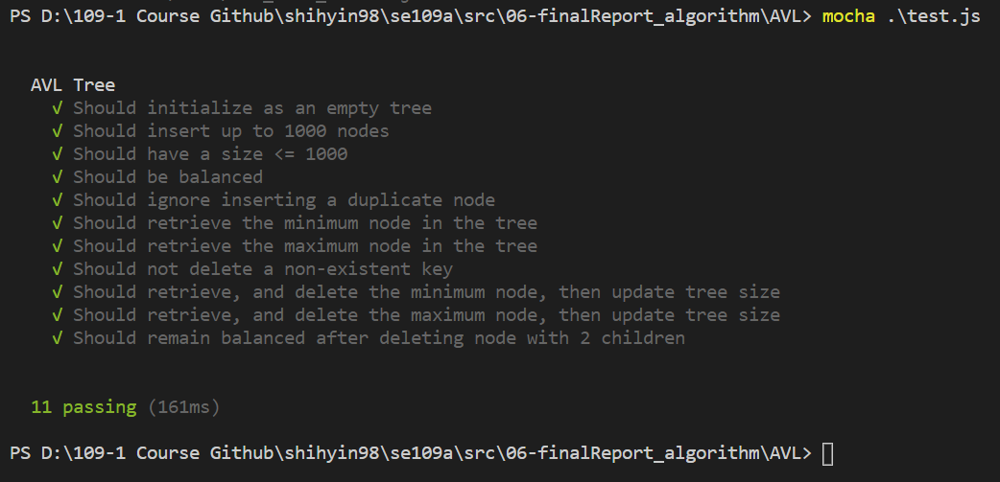

# 2. Example
* 參考文檔：[JavaScript AVL Tree_Code Review_Evan Bechtol_2019](https://codereview.stackexchange.com/questions/236660/javascript-avl-tree)
* 參考程式碼：[evanbechtol/javascript-algorithms_GitHub](https://github.com/evanbechtol/javascript-algorithms)

### Reference
[[1] AVL Tree class in Javascript_tutorialspoint](https://www.tutorialspoint.com/AVL-Tree-class-in-Javascript) 
[[2] AVL tree source code with Java_YouTube_2017](https://www.youtube.com/watch?v=tqFZzXkbbGY&t=37s) 
[[3] gwtw/js-avl-tree_GitHub](https://github.com/gwtw/js-avl-tree) 