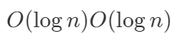

# 3. Code Explanation

* AVL 時間複雜度 **${\displaystyle O(\log {n})}O(\log{n})$**：尋找、插入和刪除在平均和最壞情況下的時間複雜度都是${\displaystyle O(\log {n})}O(\log{n})$ 。

AVL's big-O： 

### Reference
[[1] AVL樹_Wiki](https://zh.wikipedia.org/wiki/AVL树) 
[[2] [Day 2] 演算法複雜度分析──時間複雜度(Time Complexity)、空間複雜度(Space Complexity)_iThome_fion_2019](https://ithelp.ithome.com.tw/articles/10216436) 
[[3] 初學者學演算法｜從時間複雜度認識常見演算法_Medium_Cheng-Wei Hu | 胡程維_2017](https://medium.com/appworks-school/初學者學演算法-從時間複雜度認識常見演算法-一-b46fece65ba5)

