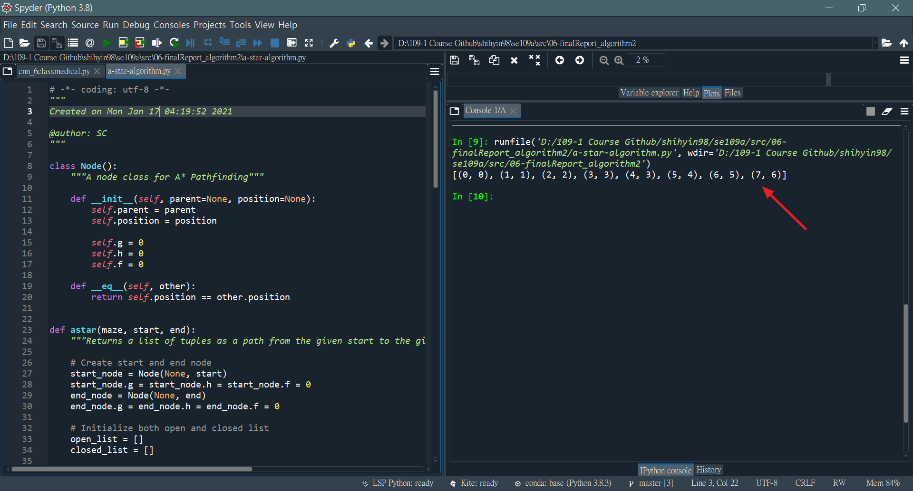
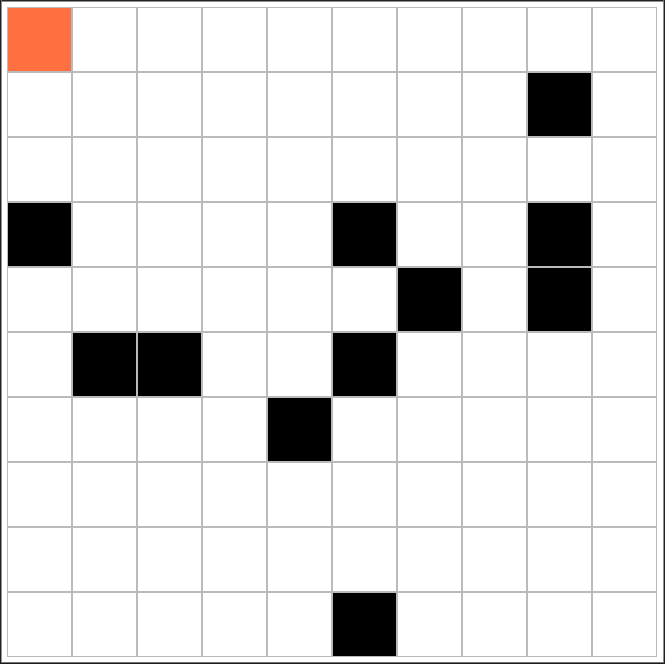

# 2. Example
* My Code：[Github](https://github.com/Shihyin98/se109a/tree/master/src/06-finalReport_algorithm2)
* 參考文檔、參考程式碼：[Easy A* (star) Pathfinding_medium](https://medium.com/@nicholas.w.swift/easy-a-star-pathfinding-7e6689c7f7b2)

* 最佳路徑：start = (0, 0)；end = (7, 6)。

### Reference
[[1] A* Search Algorithm in JavaScript](https://briangrinstead.com/blog/astar-search-algorithm-in-javascript/) 
