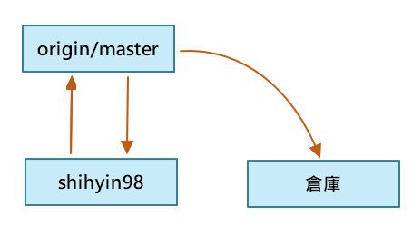

# git/github 心得報告

> 2021.09.30 (Tru.)

#### 課後習題：請學習 git/github 的基礎，寫一份心得報告
* 說明：
    參考：
    * https://backlog.com/git-tutorial/tw/
    * https://git-scm.com/book/zh-tw/v2
    * https://gitbook.tw/

## Notes
* fetch upstream
* check out
* Git 心得報告　Markdown
* 先將src新版本拉入倉庫(此時brach在上流stream)
* 再切回自己的版本，進行merge，把新版本併入。(此時check自己的的brach在自己的版本)
    

## My thoughts on Git/GitHub
* 當一個專案開發時，如果項目大，可能開發的軟體工程師就不只一位，然而當一個團隊一同開發時，就會需要工作分配，每人負責編程自己負責的程式碼部分。
* 在多人共同編程下，程式碼的編寫都會有規定，例如功能的增設、函數及變數的命名方式需要一致等，另外，使用的開發工具更是重要，在這裡程式開發的版本管理Git，以及程式開源平台GitHub便是我們必要用到的工具。
* 在Git版本管理中，擁有共享數據庫、Merge、分支(branch)等概念，方便將專案分支給每位負責的工程師，當工程師編成完自己的程式碼並上傳時，並不會即時將專案覆寫掉，而是透過每一次提交程式碼的紀錄的時間序做版本管理。
* 而專案的合併便是交由權力最大的master做決定，可以選擇是否要合併。

